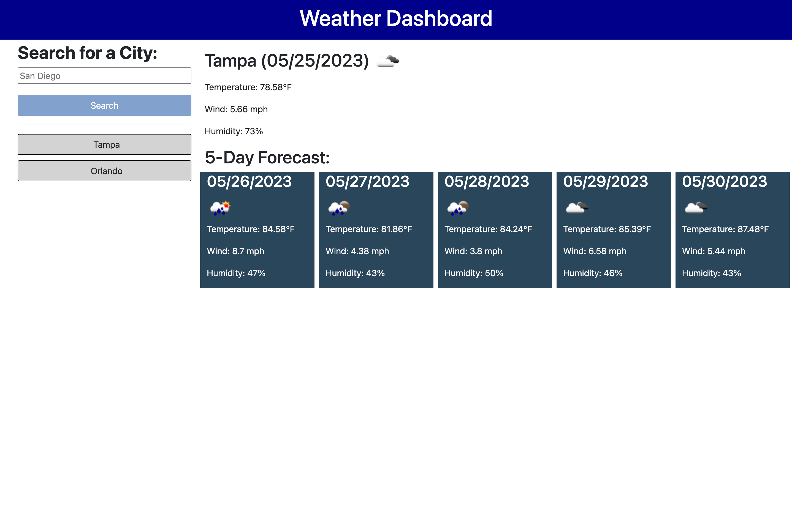

# weather-dashboard
A weather dashboard for users to search and view the current and five-day weather forecast for a city.

## Usage

To use this project, you can review the html, css, and js files. To test your own suggestions on what to adjust in the html or css, open the Chrome DevTools by pressing Command+Option+I (macOS) or Control+Shift+I (Windows). Try any changes in the console panel and see then update in real time. 

-  This weather dashboard allows users to search and view the current and five-day weather forecast for a city.
-  It displays the city name, the date, an icon representation of weather conditions, the temperature, the humidity, and the wind speed.
-  Also displays a five-day forecast with the date, an icon representation of weather conditions, the temperature, the humidity and the wind speed.

Link to the [deployed application](https://amandajduva.github.io/weather-dashboard/). 

Screenshot of deployed application:

## Credits

While I wrote the code for this application, I received support from received support from a tutor to understand the structure of the application and fetching data from the API.
## License

Please refer to the LICENSE in the repo.